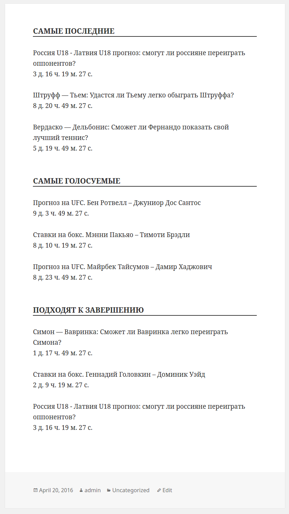
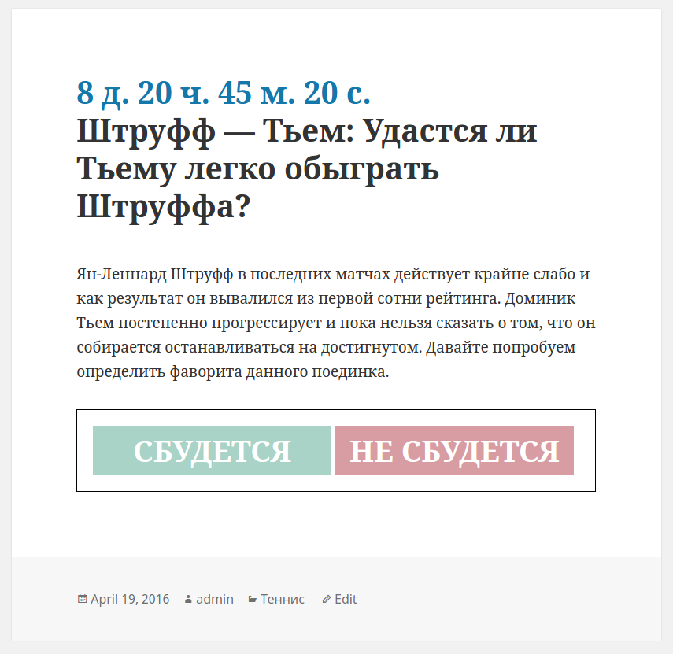

# "Будет-Не будет"

> Попробовал выполнить тех задание уже "завершенного" проекта. Выполнял для тренировки, реализация этого варианта в рамках описаного ТЗ.

## Тех задание проекта
Вариант выполнения проекта с фриланс биржи https://www.fl.ru/projects/2728444/nujen-spetsialist-po-wordpress.html

Текст ТЗ:
> 1. Добавить к постам новое поле ввода даты. В которое можно ввести дату от текущей+10 часов(по умолчанию) до бесконечности. Чтобы при вводе даты в админке отображался и счетчик обратного отсчета до этой даты в формате "годы дни часы минуты секунды"
> 2. Сделать вывод обратного отсчета до этой даты в самом посте над заголовком большими буквами и в категориях(списках постов), тоже над заголовком в формате "годы дни часы минуты секунды"
> 3. К каждому посту добавить голосование в двумя вариантами ответов: будет, не будет.
> 4. На главную и категории вывести 3 колонки:самые последние посты, ближайшие по введенной в поле дате, набравшие наибольшее кол-во голосов в голосовании из пункта 3

## Реализация
Задание реализовано в виде плагина.

У постов, для которых установлена дата окончания голосования, на фронтенде появляются кнопки для голосования, доступные незарегистрированным. После нажатия кнопки голосования пользователем, данные о его голосе передаются ajax-запросом и записываются в localStorage(простая защита от множественного голосования). Для вывода таких элементов как: счётчик времени, кнопки для голосования, в определённых ТЗ местах зарегистрированы хуки, которые выполняют шорткоды.

### Шорткоды

Разметка и стили шорткодов вынесены в отдельные шаблоны для удобства дизайна.

#### [tobeontop]

Выводит ссылки на посты, отобранные по 3-м критериям:
- по дате публикации (ранние сверху)
- по самым голосуемым
- по самым близким к завершению

Если выводится на главной странице, то отбор идёт по всем постам во всех категориях постов, а если из категории, то выбираются посты принадлежащие этой категории

#### [tobeornot (counter|voter|result|admin)]

- counter - счётчик обратного отсчёта в виде html (используется на фронтенде)
- counter_text - счётчик обратного отсчёта без оформления (используется в админке)
- counter_timestamp - счётчик обратного отсчёта в формате timestamp
- voter - кнопки для голосования
- result - результаты голосования

## Скриншоты и демо-данные

Файл экспорта с демо-данными в формате [xml](demo/testpress.wordpress.2016-04-21.xml)

Демонстрация работы шорткода `[tobeontop]` (не стилезован) с темой сайта *Twenty Fifteen*

Демонстрация работы шорткода `[tobeornot]` (стили по-умолчанию) с темой сайта *Twenty Fifteen*

